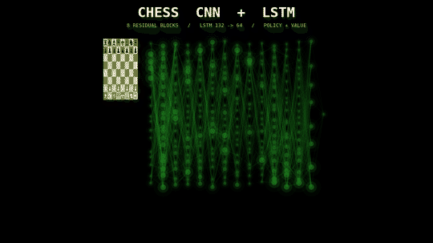

# Chess AI - Vincent Do

A playable chess application with multiple AI opponents and several generations
of policy/value networks. The current code supports a human-game-imitation v3
ResNet and an engine-distilled v4 SE-ResNet, each with optional MCTS search. It
runs as a browser app (Flask backend + static frontend) and as a Pygame desktop
app.

**Live site:** https://vincentdo1.github.io/playable-chess-AI
**Backend (Railway):** drives the live site for Alphabeta and the configured
neural-network checkpoint. Check the backend health response before assuming
which model generation is live.

> GitHub Pages serves the `main` branch. Changes on other branches won't appear on the live site until merged to `main`.

<p align="center">
  
  <br/>
  <em>Legacy v2 CNN + LSTM visualization. The v3/v4 architectures no longer use
  the move-history LSTM. <a href="media/network.mp4">MP4</a></em>
</p>

Current project truth is split deliberately:

- [Project status](docs/PROJECT_STATUS.md) — trained, benchmarked, deployed, and
  still-unverified states.
- [v4 model card](docs/MODEL_CARD.md) — provenance, intended use, metrics, and
  limitations.
- [Railway runbook](docs/RAILWAY_DEPLOY.md) — rollout and rollback.
- [2500 benchmark roadmap](docs/ROADMAP_2500.md) — historical strategy and
  experiment log.

---

## Players

- **Random** — picks a legal move at random.
- **Alphabeta** — minimax + alpha-beta pruning + endgame-aware heuristics.
- **Stockfish** — UCI engine (desktop) or WebAssembly (browser).
- **Neural-network player** — a perspective policy/value ResNet. The code
  default is the v3 human-game-imitation checkpoint; deployments can select the
  v4 engine-distilled checkpoint through `MODEL_PATH`. Older v2 checkpoints
  remain loadable. The browser labels this option **Neural Network**. The
  `magnus` API value and `magnus_carlsen` desktop value are legacy compatibility
  identifiers, not claims that a model simulates or is endorsed by Magnus
  Carlsen.

---

## Quick start (local play)

```powershell
# 1. Python 3.12 venv + dependencies
py -3.12 -m venv .venv
.\.venv\Scripts\Activate.ps1
pip install torch --index-url https://download.pytorch.org/whl/cu124   # /cpu if no GPU
pip install -r requirements-local.txt

# 2. Put a trained model in model/ (gitignored; you provide it)
#    Default expected path: model/grandmaster_resnet_v3.pt
#    Either train it (see "Training") or copy in an existing checkpoint.
#    Old v2 checkpoints also work: point MODEL_PATH at them.

# 3. Verify the environment
$env:REQUIRE_CUDA = "1"     # "0" for CPU
python -m training.check_training_env

# 4. Start the backend (serves model/grandmaster_resnet_v3.pt by default)
$env:MAGNUS_USE_MCTS = "1"
$env:MAGNUS_MCTS_SIMULATIONS = "200"
python app.py

# 5. In a second terminal, serve the frontend
python -m http.server 8000
```

Open `http://localhost:8000`. If **Neural Network** is greyed out, the backend
failed to load the model—check the backend terminal for the model-unavailable
message and its reason.

---

## Repository layout

```
playable-chess-AI/
  app.py                   Compatibility launcher for local Flask use
  main.py                  Pygame desktop entry
  neural_network.py        Model architecture + supervised trainer
  load_model.py            Checkpoint loading + raw-policy inference
  chess_player.py          Non-NN players (alphabeta, random, Stockfish)
  heuristics.py            Piece-square tables for chess_player
  index.html               Frontend shell for GitHub Pages
  stockfish.js             Stockfish WASM for browser play
  Procfile                 Railway Gunicorn entry

  backend/                 Flask API
    app.py                 Routes, model loading, MCTS controls; Procfile target
  frontend/src/            Browser ES modules
  pieces/                  Chess piece PNGs (used by frontend + Pygame)
  tests/                   mixed standalone/unit and artifact-dependent checks

  inference/               NN-augmented inference
    mcts_player.py         PUCT/MCTS
    search_player.py       Alpha-beta with NN evaluator
    blunder_guard.py       Shallow-search veto of material-losing policy moves
  training/                Training pipeline
    preprocess.py          PGN -> .npz chunks
    dedup_positions.py     Cap duplicate (mostly opening) positions pre-retrain
    ingest_lichess_evals.py  Lichess evaluations -> v4 Parquet shards
    train_distill.py       v4 engine-distillation trainer
    resume_training.py     Safe resumed supervised training
    check_training_env.py  CUDA/torch preflight
    extract_lichess_gm_vs_lower.py
  experiments/             Not production
    self_play.py           AlphaZero-style data generation
    train_self_play.py     AlphaZero-style iteration loop
  evaluation/              Match-based and test-set evaluation
    eval_arena.py          Paired-opening Elo with 95% CI
    evaluate_model.py      Held-out test-set metrics
    cross_model_match.py   Cross-branch model matches (subprocess)
    move_server.py         JSON line move server (companion)
    play_match.py          Headless engine matches, PGN output
  scripts/
    train_pipeline.sh      preprocess -> train -> self-play
    compare_checkpoints.ps1   Full Elo comparison matrix

  docs/
    PROJECT_STATUS.md      Current implementation/release status
    MODEL_CARD.md          v4 model provenance and limitations
    RAILWAY_DEPLOY.md      Production rollout/rollback runbook
    ROADMAP_2500.md        Historical strategy and measurement log

  .github/                 CI, CODEOWNERS, and pull-request template
  CONTRIBUTING.md          Review, evidence, and validation expectations
  THIRD_PARTY_NOTICES.md   Dependency/data notices and provenance gaps

  model/                   PyTorch checkpoints   (gitignored)
  data/                    Training chunks       (gitignored)
  extractions/             Raw PGN archives      (gitignored)
  analysis_games/          play_match PGN output (gitignored)
  eval_logs/               compare_checkpoints   (gitignored)
```

Subpackages use absolute import paths (`from inference.mcts_player import ...`). Run scripts inside subpackages with `python -m`, e.g. `python -m evaluation.eval_arena --model_a ...`.

---

## Training

There are two separate training paths:

- The legacy human-game path preprocesses PGNs, trains v2/v3, and can continue
  into experimental self-play through `scripts/train_pipeline.sh`.
- The v4 path ingests engine-evaluated Lichess positions and runs
  `training.train_distill`. It is a large, multi-day workflow, not part of the
  legacy three-stage shortcut.

The ignored datasets and checkpoints are not recoverable from Git alone. Before
a long v4 run, pin the upstream data revision, preserve the generated ingest
manifest, and record the complete training environment and output digest. See
the [model card](docs/MODEL_CARD.md) for the missing provenance fields in the
historical full run.

### Architectures

Three model generations coexist:

| | v2 | v3 (code default) | v4 engine-distilled |
|---|---|---|---|
| Checkpoint dispatch | legacy/fallback | `board_encoding=perspective_v3` | `arch_version=v4` |
| Board input | 17 channels (`perspective_v2`) | 20 channels (`perspective_v3`) | 20-channel `perspective_v3` tensor; channels 17-19 masked (17 effective) |
| Move history | LSTM over the last 10 moves | none | none |
| Tower | ResNet + LSTM | 128-filter, 8-block ResNet | 256-filter, 12-block SE-ResNet |
| Policy head | FC, 20,480 flat vocabulary | convolutional, 4,864 vocabulary | convolutional, 4,864 vocabulary |
| Value head | scalar | scalar | scalar |
| Training signal | human games | Magnus/GM games | Lichess positions labeled by Stockfish analysis |

v3 and v4 deliberately share the board encoding, so encoding alone cannot
select the architecture. The loader checks `arch_version` first and then falls
back to `board_encoding` for older checkpoints. The v4 distillation data stores
four-field FENs and therefore never supervised the halfmove-clock or repetition
planes. Current v4 inference zeros those three planes at the model boundary;
this removes an uncontrolled train/serve input but also means v4 cannot use
clock or repetition state.

`ARCH_VERSION=v2|v3` applies to the legacy supervised trainer. v4 uses
`training.train_distill`. The default local `MODEL_PATH` remains
`model/grandmaster_resnet_v3.pt`; set it explicitly to serve another checkpoint.

The recorded v3-over-v2 comparison was 17W-10D-5L over 32 paired games in
greedy policy mode (+137 Elo in that model-vs-model harness, reported 95% CI
[+40, +261]). It is not an absolute human rating.

### 1. Preprocess

```powershell
python -m training.preprocess              # v3 chunks -> data/*_chunks_v3
python -m training.preprocess --no_cp_loss # game-result value targets only
$env:PREPROCESS_ENCODING = "perspective_v2"  # legacy v2 chunks if needed
```

Reads `extractions/GM_games_2600.zip` and `extractions/magnus.zip`, writes `data/{train,val,test}_chunks_v3/`.

Optionally cap duplicated opening positions before training (82% of v2
opening samples were repeats, which starves middlegame learning):

```powershell
python -m training.dedup_positions --input_dir data/train_chunks_v3 `
  --output_dir data/train_chunks_v3_dedup --max_repeats 4
```

Adding Lichess strong-vs-weak as negatives:

```powershell
python -m training.extract_lichess_gm_vs_lower `
  --input "lichess_db_standard_rated_2026-04.pgn.zst" `
  --output "extractions\lichess_2500_vs_u2200.pgn" `
  --gm_min_elo 2500 --opponent_max_elo 2200 --max_games 100000

python -m training.preprocess `
  --single_pgn "extractions\lichess_2500_vs_u2200.pgn" `
  --output_dir "data\train_chunks_lichess" `
  --policy_color_mode tagged
```

### 2. Supervised training

```powershell
$env:REQUIRE_CUDA = "1"
python neural_network.py
```

v3 by default: reads `data/{train,val}_chunks_v3`, writes
`model/grandmaster_resnet_v3.pt`. Set `ARCH_VERSION=v2` for the legacy
architecture (reads `data/{train,val}_chunks`, writes the v2 checkpoint);
`TRAIN_DIR`/`VAL_DIR`/`MODEL_PATH` override any of the paths.

Up to 50 epochs, early stopping, AMP + cuDNN benchmark enabled. Set `INIT_MODEL_PATH` to warm-start from a previous checkpoint (current architecture only).

### v4 engine distillation

New ingests require an immutable Hugging Face dataset commit SHA; branch names
such as `main` are rejected. The ingester validates downloaded Parquet files,
records source-shard identities and parameters, and writes a completed
`ingest_manifest.json`. The trainer verifies that manifest and records its
digest and training configuration in new checkpoints.

The full historical workflow downloads roughly 41 GB and starts a multi-day GPU
run. It is fail-closed unless `-Execute` and a source revision are explicit:

```powershell
$sourceRevision = "REPLACE_WITH_40_TO_64_HEX_HF_COMMIT"
.\run_phase2.ps1 -Execute -SourceRevision $sourceRevision
```

Set `LICHESS_EVAL_REVISION` instead of `-SourceRevision` if preferred. Resume is
also explicit:

```powershell
$sourceRevision = "REPLACE_WITH_40_TO_64_HEX_HF_COMMIT"
.\run_phase2.ps1 -Execute `
  -SourceRevision $sourceRevision `
  -ResumeCheckpoint model\grandmaster_resnet_v4_full.pt.midtrain
```

Do not reuse a corpus without its completed manifest, silently overwrite a
checkpoint, or present the historical v4 model as reproducible: its original
source revision was not recorded. New manifests improve future runs but cannot
retroactively identify that dataset snapshot.

The script's gauntlets write JSON and PGN artifacts under
`evaluation/results/phase2_<elo>`. Every rung requires model p95 latency no
greater than two seconds; the 2500 rung additionally requires the paired-game
95% score lower bound to be at least 50%. A point estimate above 50% with a
lower bound below 50% therefore fails the gate.

### 3. Resume / fine-tune

If Stage 2 stops early before convergence:

```powershell
python -m training.resume_training `
  --init   model\grandmaster_model_perspective_resnet_negatives_v2.pt `
  --output model\grandmaster_resnet_v2_resumed.pt `
  --epochs 40 --lr 3e-4 --early_stop_patience 10 --lr_patience 4
```

Only writes the output if val_loss strictly beats the source, so it cannot regress your current model.

### Pipeline shortcut

```powershell
bash scripts/train_pipeline.sh
```

This shortcut trains the v3 human-imitation path and then starts experimental
self-play. It does not reproduce the v4 engine-distilled checkpoint.

---

## Evaluation

Use evaluation results only with the exact checkpoint, engine, search, time,
opening, and hardware configuration that produced them. Model-vs-model Elo and
Stockfish `UCI_Elo` harness results are not interchangeable with human ratings.

**`eval_arena.py`** — head-to-head Elo with 95% CI, paired opening suite:

```powershell
python -m evaluation.eval_arena `
  --model_a model\grandmaster_resnet_v3.pt `
  --model_b model\grandmaster_resnet_v2_resumed.pt `
  --method_a mcts --method_b mcts `
  --paired --games 128 --sims 200 --mcts_batch_size 16
```

(Greedy policy-mode baseline, 32 paired games, 2026-07-02: v3 beat
v2-resumed 17W-10D-5L, +137 Elo within this harness, reported 95% CI
[+40, +261].)

Methods per side: `mcts`, `policy`, or `search`.

**`cross_model_match.py`** — subprocess-isolated matches for incompatible architectures (e.g. an old-branch checkpoint vs the current one). Needs `move_server.py` present in each worktree:

```powershell
git worktree add ..\playable-chess-AI-other other-branch
Copy-Item evaluation\move_server.py ..\playable-chess-AI-other\

python -m evaluation.cross_model_match `
  --player_a_dir ..\playable-chess-AI-other --player_a_model model\old.pt `
  --player_b_dir .                         --player_b_model model\new.pt `
  --games 20 --player_a_temperature 0.5 --player_b_temperature 0.5
```

**`compare_checkpoints.ps1`** — runs the full 4-way matrix (resumed vs base & vs self-play, in both mcts and policy):

```powershell
.\scripts\compare_checkpoints.ps1 `
  -Resumed  model\grandmaster_resnet_v2_resumed.pt `
  -Base     model\grandmaster_model_perspective_resnet_negatives_v2.pt `
  -SelfPlay model\selfplay_checkpoints\selfplay_iter0020.pt `
  -Sims 200 -Games 128
```

For held-out test-set metrics (defaults to the served checkpoint and its
encoding-matched `data/test_chunks[_v3]`; pass `--model`/`--test_dir` to
measure another one):

```powershell
python -m evaluation.evaluate_model --examples 10
```

**`vs_stockfish.py`** — a harness for a configured Stockfish opponent:

```powershell
python -m evaluation.vs_stockfish `
  --model model\grandmaster_resnet_v4_full.pt `
  --mode mcts --sims 200 --mcts_batch_size 16 `
  --uci_elo 2500 --movetime 0.6 --no_blunder_guard `
  --output_dir evaluation/results `
  --require_score_lower_bound 0.50 --require_p95_seconds 2.0
```

With `--games 0` (the default), the evaluator plays the built-in 16-opening
suite with colors reversed for 32 games. It seeds the run, computes confidence
intervals over opening-pair averages, records code/model/Stockfish/opening and
environment metadata, measures model-move p50/p95/max latency, and writes JSON
plus PGN artifacts. The optional gates above exit nonzero unless the lower 95%
score bound is at least 50% and p95 model latency is at most two seconds.

The 2026-08-11 v4 result was produced before this protocol existed: 12W-9D-3L
(68.8%) over 24 start-position games against Stockfish 18 limited-strength mode.
It also predates the v4 input-plane mask, so it does not validate current masked
inference. It remains a historical point estimate, not proof of a general 2500
rating, and must not be described as a result from the new paired harness. See
the [project status](docs/PROJECT_STATUS.md) and
[model card](docs/MODEL_CARD.md).

**Phase diagnostics** — why does play degrade as the game goes on?

```powershell
# Policy/value quality by move-number bucket; also quantifies the
# FEN-only (zero move history) serving skew vs eval conditions.
python -m evaluation.diagnose_phase_degradation --max_positions 150000

# Stockfish cp-loss of the move the live backend would actually play,
# policy-only vs value-reranked, per phase.
python -m evaluation.diagnose_value_rerank --per_phase 150

# Same protocol, measuring the inference/blunder_guard.py effect.
python -m evaluation.diagnose_blunder_guard --per_phase 150 --guard_depth 2
```

---

## Self-play (experimental)

AlphaZero-style: the network plays itself with MCTS, training targets are MCTS visit distributions and game outcomes.

```powershell
python -m experiments.train_self_play `
  --init_checkpoint model\grandmaster_resnet_v3.pt `
  --iterations 20 `
  --mcts_simulations 400 --mcts_batch_size 16
```

The first attempt (LR 1e-3, 1000 steps/iter, 50 games/iter, self-play-only
buffer) collapsed from catastrophic forgetting — iter20 lost 20-0 to its
base. The defaults now implement the retry recipe:

- LR `1e-4`, `100` training steps/iter, `200` games/iter
- supervised chunks mixed into every batch (`--supervised_dirs`,
  default `data/train_chunks_v3`, 50/50 via `--supervised_fraction`)
- after each iteration a `--gate_games` policy-mode match runs against the
  pre-iteration weights; scoring under `--gate_min_score` (0.45) reverts the
  weights and stops the run. Failed iterations write no checkpoint.

Still don't deploy a self-play checkpoint without beating the base in `eval_arena`.

---

## Backend API

`backend/app.py` is the Flask app served on port 5000 and the direct Gunicorn
target in the `Procfile`. Root `app.py` remains a compatibility launcher for
local development.

```powershell
# MODEL_PATH defaults to model/grandmaster_resnet_v3.pt; set it to serve
# a different checkpoint (v2 files still load).
$env:MAGNUS_USE_MCTS    = "1"
$env:MAGNUS_MCTS_SIMULATIONS = "200"
python app.py
```

**Endpoints:**

`GET /livez` — process liveness.

`GET /readyz` — serving readiness. A process that is running with a required
capability unavailable returns 503; an explicitly required model or MCTS import
failure normally stops startup instead. `GET /` retains the same readiness
payload for compatibility.

`POST /api/move` — get the next move.

```json
{ "fen": "<FEN>", "player": "alphabeta", "depth": 3 }
{ "fen": "<FEN>", "player": "magnus", "temperature": 0.0, "value_weight": 2.0, "value_candidates": 0 }
{ "fen": "<FEN>", "player": "magnus", "use_mcts": true }
```

Clients may disable server-enabled MCTS or request fewer simulations, but they
cannot enable MCTS when the server disables it or exceed the server's effective
simulation limit. MCTS responses distinguish the client's requested count, the
server-capped budget, and the simulations actually completed, and also report
elapsed search time and stop reason. CPU-heavy inference is bounded by a server
semaphore; excess concurrent requests receive HTTP 429.

**Backend env vars:**

| Var | Default | Purpose |
|---|---|---|
| `MODEL_PATH` | `model/grandmaster_resnet_v3.pt` | Path to a compatible v2, v3, or v4 checkpoint |
| `MAGNUS_TEMPERATURE` | `0.0` | Policy sampling temperature |
| `MAGNUS_VALUE_WEIGHT` | `2.0` | Value-head reranking weight (policy mode) |
| `MAGNUS_VALUE_CANDIDATES` | `0` | Top-K policy candidates to value-check (0 = all) |
| `MAGNUS_BLUNDER_GUARD` | `1` | Shallow-search veto of material-losing policy moves (policy mode) |
| `MAGNUS_BLUNDER_GUARD_DEPTH` | `2` | Guard search depth (2 ≈ 20 ms/move, 3 ≈ 130 ms/move) |
| `MAGNUS_BLUNDER_GUARD_MARGIN` | `150` | Veto candidates this many cp worse than the best candidate |
| `MAGNUS_USE_MCTS` | `0` | Enable MCTS globally |
| `MAGNUS_MCTS_SIMULATIONS` | `200` | Sims per move |
| `MAGNUS_MCTS_MAX_SIMULATIONS` | `800` | Independent hard ceiling; effective limit is the lower of this and `MAGNUS_MCTS_SIMULATIONS` |
| `MAGNUS_MCTS_BATCH` | `16` | Leaf-eval batch size |
| `MAGNUS_MCTS_C_PUCT` | `1.5` | PUCT exploration constant |
| `MAGNUS_MCTS_POLICY_TEMP` | `1.5` | Policy-prior softening |
| `MAGNUS_MCTS_TIME_LIMIT` | `0` | Soft wall-time cap in seconds; 0 disables it |
| `MAGNUS_REQUIRED` | enabled when a model/HF path is explicit | Fail startup/readiness if the configured neural-network capability is unavailable |
| `MAGNUS_HF_REPO` | unset | Hugging Face model repository used when `MODEL_PATH` is absent locally |
| `MAGNUS_HF_REVISION` | required with `MAGNUS_HF_REPO` | Immutable Hugging Face commit revision |
| `MAGNUS_MODEL_SHA256` | unset | Optional expected checkpoint digest; mismatch fails loading |
| `MAGNUS_ALLOW_FLOATING_HF_REVISION` | `0` | Local-only escape hatch for an unpinned HF revision; do not set in staging or production |
| `INFERENCE_MAX_CONCURRENCY` | `1` | Maximum simultaneous move computations |
| `MAX_REQUEST_BYTES` | `16384` | Maximum JSON request size |
| `MAGNUS_ALLOWED_ORIGINS` | production + local frontend origins | Comma-separated CORS allowlist |

---

## Desktop app (Pygame)

Loads the model directly (no backend); `MODEL_PATH` defaults to
`model/grandmaster_resnet_v3.pt`:

```powershell
python main.py --black_player magnus_carlsen
```

`--white_player` / `--black_player` options: `you`, `random`, `alphabeta`,
`engine` (Stockfish), `magnus_carlsen`. The last value is a legacy CLI
identifier for the neural-network player.

---

## Production deployment

The live frontend calls a Railway backend configured in
`frontend/src/config.js`. Checkpoint files are gitignored, so a code deployment
does not identify or ship a model release.

Follow [the Railway rollout and rollback runbook](docs/RAILWAY_DEPLOY.md). A
release requires an immutable model revision, recorded digest, staging cold
start, readiness and legal-move smoke checks, observed resource/latency data,
and a tested previous deployment or artifact/config bundle for rollback.

Do not unset model variables and assume an in-repo v3 fallback: clean Railway
instances have ephemeral filesystems and the default checkpoint is also
gitignored. Do not infer the loaded generation from the filename alone; verify
the deployed artifact and service response.

---

## Tests

Install the artifact-independent test environment and run the same suite as CI:

```bash
python -m pip install --requirement requirements-test.txt
python -m pytest -q
```

GitHub Actions runs this fast suite on pull requests and pushes to `main`.
Checks that require ignored checkpoints, datasets, or a Stockfish binary are
marked artifact-dependent and may skip in a clean checkout. Provision those
artifacts locally and attach their machine-readable outputs to an ML pull
request; a green fast suite is not equivalent to full training/evaluation
integration coverage. See [CONTRIBUTING.md](CONTRIBUTING.md).
